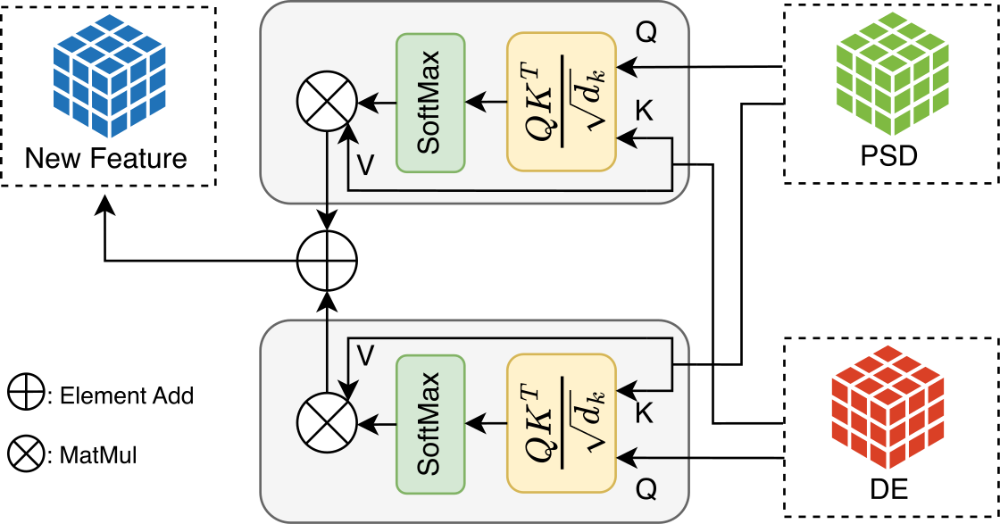

# MCA

Feature Fusion Based on **M**utual-**C**ross-**A**ttention
Mechanism for EEG Emotion Recognition

arXiv: [2406.14014](https://arxiv.org/abs/2406.14014)

Springer: MICCAI 2024 (Will be updated once available)

## MCA Introduction


MCA is a purely mathematical method applying Attention Mechanism from each directions of two features. In the field of EEG emotion analysis, we are the first to propose a pure mathematical fusion method, coupled with customized 3D-CNN, to accomplish the task of feature fusion.

## Datasets
To acquire the original datasets, please refer to the official website of [DEAP](https://www.eecs.qmul.ac.uk/mmv/datasets/deap/index.html). We used the preprocess method from open-source repository [DEAP_MNE_preprocessing](https://github.com/gzoumpourlis/DEAP_MNE_preprocessing). And we finally got the preprocessed datasets, which can be obtained from [Google Drive](https://drive.google.com/drive/folders/1jRQRbRgTIZEDByQYz41CuoyzPe45hxHv?usp=drive_link).

## Get Started

**Installation**
``` bash
conda env create -f environment.yml

conda activate MCA-EEG
```

**Train**

Download the preprocessed datasets and put them under the implementation directory. Then, open the `mca_experiment.ipynb` and modify the path to your data directory. Run the notebook to train the model.

**Test**

Specify the validation type in the `mca_validations.ipynb` and run the notebook to test the model. You can get confusion matrix and accuracy.
``` python
# The default validation type is 'valence', change to validate others
# ['valence', 'arousal', 'dominance', 'liking']
validation_type = 'arousal'
```

## License

The model is licensed under the [Apache 2.0 license](LICENSE)


## Acknowledgements

+ [DEAP_MNE_preprocessing](https://github.com/gzoumpourlis/DEAP_MNE_preprocessing)

## Citation
Our paper has been accepted by MICCAI 2024. Remenber to cite the paper if you find this work useful.

``` bibtex
@inproceedings{Zhao2024MCA,
  title = {Feature Fusion Based on Mutual-Cross-Attention Mechanism for EEG Emotion Recognition},
  booktitle = {Medical Image Computing and Computer Assisted Intervention –- MICCAI 2024},
  author = {Zhao, Yimin and Gu, Jin},
  year = {2024},
  month = jun,
  number = {arXiv:2406.14014},
  eprint = {2406.14014},
  publisher = {arXiv},
  urldate = {2024-06-21},
  archiveprefix = {arxiv},
}
```

<!-- @inproceedings{Zhao2024MCA,
  title={Feature Fusion Based on Mutual-Cross-Attention Mechanism for EEG Emotion Recognition},
  author={Zhao, Yimin and Gu, Jin},
  booktitle={Proceedings of the International Conference on Medical Image Computing and Computer-Assisted Intervention (MICCAI)},
  pages={start page-end page},
  year={2024},
  organization={MICCAI Society}
} -->
